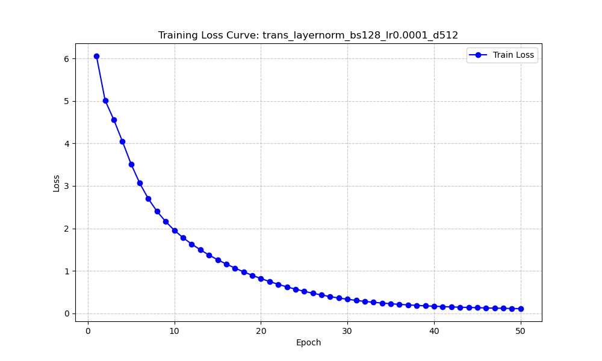
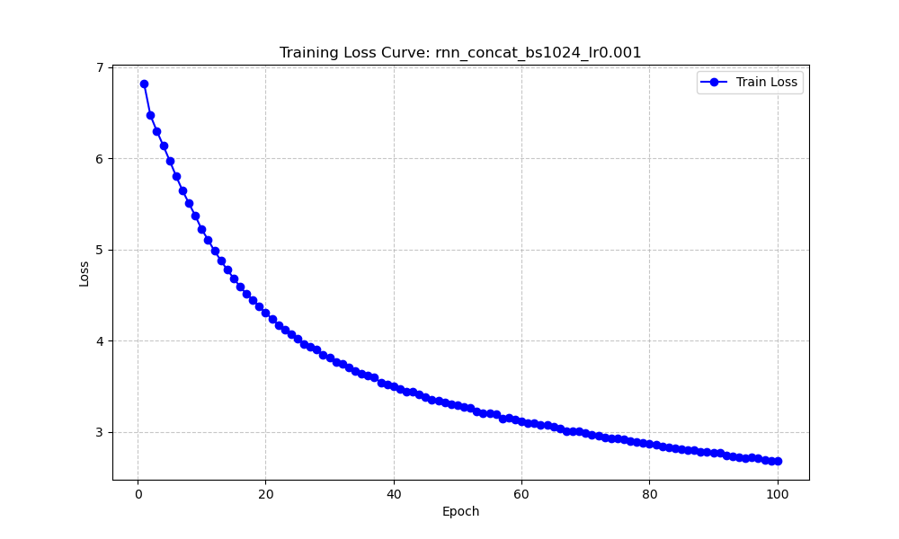
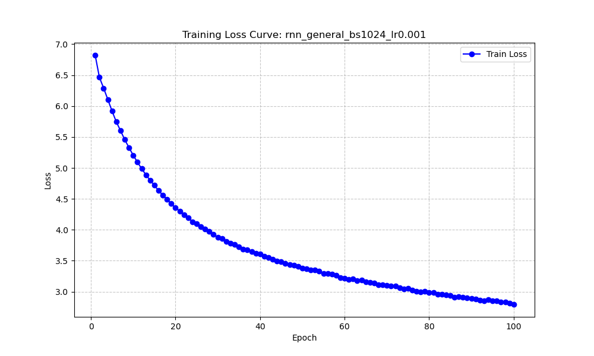

# Neural Machine Translation: RNN vs. Transformer
**Course:** Natural Language Processing and Large Language Models  
**Project:** Midterm & Final Project - Chinese-English Machine Translation  
**Student ID:** 250010120 
**Name:** Xiaobin Xu 
**Date:** December 28, 2025

---

## **Code Repository**
**GitHub URL:**  [Natural-Language-Processing-and-Large-Language-Models](https://github.com/Xu-Xiaobin/Natural-Language-Processing-and-Large-Language-Models)  
*(The repository contains the source code, training scripts, `inference.py`, and the hyperparameter tuning logs.)*  

**Checkpoint Link:**   [Checkpoints](https://drive.google.com/drive/folders/172OShmSPQlSIctdg4hNY3MBhDFjSs8Wp?usp=drive_link)  
*(download the files into root direction, such as `./checkpoints_trans/`)* 

---

## 1. Introduction
The objective of this project is to implement and compare two distinct architectures for Neural Machine Translation (NMT): Recurrent Neural Networks (RNN) and Transformers. Using a Chinese-to-English parallel corpus, we aim to analyze the impact of attention mechanisms in RNNs and investigate the training stability and performance of Transformers under different hyperparameter settings.

## 2. Model Architecture

### 2.1 RNN-Based NMT (Seq2Seq)
The RNN model follows the Sequence-to-Sequence (Seq2Seq) architecture with an Encoder-Decoder structure.
* **Encoder:** A 2-layer GRU (Gated Recurrent Unit) that processes the source sentence.
* **Decoder:** A 2-layer GRU that generates the target sentence token by token.
* **Attention Mechanisms:** We implemented three alignment functions:
    1.  **Dot-Product:** $score(h_t, \bar{h}_s) = h_t^\top \bar{h}_s$
    2.  **Multiplicative (General):** $score(h_t, \bar{h}_s) = h_t^\top W_a \bar{h}_s$
    3.  **Additive (Concat/Bahdanau):** $score(h_t, \bar{h}_s) = v_a^\top \tanh(W_a [h_t; \bar{h}_s])$

### 2.2 Transformer-Based NMT
The Transformer model relies entirely on self-attention mechanisms, discarding recurrence.
* **Structure:** Standard Encoder-Decoder with Multi-Head Self-Attention and Feed-Forward Networks.
* **Ablation Variations:**
    * **Normalization:** Compared **LayerNorm** (standard) vs. **RMSNorm** (simplified, re-scaling only).
    * **Model Scale:** Tested Base ($d_{model}=512$) and Small ($d_{model}=256$) configurations.
    * **Positional Encoding:** Absolute Sinusoidal Embeddings.

## 3. Implementation Details

### 3.1 Data Preprocessing
* **Tokenization:** `Jieba` for Chinese, `NLTK` for English.
* **Vocabulary:** Constructed from the training corpus with special tokens (`<sos>`, `<eos>`, `<pad>`, `<unk>`).

### 3.2 Code Structure
The codebase is organized into modular components to ensure scalability and ease of experimentation:

* **`config.py`**: Centralizes all configuration parameters, including file paths, model hyperparameters (hidden dimensions, layers), and training settings (learning rate, batch size), allowing for easy adjustments without modifying core logic.
* **`data_utils.py`**: Manages data preprocessing pipeline. It handles dataset loading from JSONL files, performs tokenization (using `Jieba` for Chinese and `NLTK` for English), builds vocabulary, and implements the `collate_fn` for dynamic batch padding.
* **`model_rnn.py`**: Defines the Seq2Seq RNN architecture using GRU. It includes the `Encoder`, `Decoder`, and a flexible `Attention` module supporting Dot-Product, General, and Concat alignment functions.
* **`model_transformer.py`**: Implements the Transformer-based NMT model. It includes classes for Positional Encoding (Absolute) and supports ablation studies for Normalization layers (standard `LayerNorm` vs. `RMSNorm`).
* **`train.py`**: Contains the core training logic. It defines the `train_epoch` and validation loops, computes loss (CrossEntropy), and handles optimizer steps.
* **`grid_search.py`**: A master script for automated hyperparameter tuning. It defines the experiment parameter grid, manages multi-GPU training using `DataParallel`, automatically generates unique experiment directories, and logs training progress.
* **`inference.py`**: Provides the inference engine. It includes functions to load trained models and perform translation using either **Greedy Decoding** or **Beam Search** strategies.
* **`batch_evaluate.py`**: A utility script to load trained checkpoints, perform batch translation on the test set, and compute quantitative metrics (BLEU scores) using `sacrebleu`.
* **`plot_curves.py`**: parses training logs (`train_log.txt`) from experiment directories and generates visualization figures for training loss convergence.
* **`requirements.txt`**: Lists all necessary Python dependencies (e.g., `torch`, `jieba`, `sacrebleu`, `tqdm`) to reproduce the environment.

### 3.3 Hardware & Training Setup
* **Hardware:** **4 $\times$ NVIDIA H100 (80GB)** GPUs using `torch.nn.DataParallel`.
* **Batch Size Strategy:**
    * Initial experiments (RNN & Failed Transformer): Global Batch Size = 1024 (256 per card).
    * **Optimized Transformer:** Reduced Global Batch Size to **128** to increase parameter update frequency.
* **Learning Rate:**
    * RNN: $0.001$.
    * Transformer: Reduced to **$0.0001$** to prevent gradient explosion/collapse.

## 4. Experimental Results

### 4.1 Quantitative Evaluation (BLEU Scores)
We evaluated the models using `sacrebleu` on the test set. The results show a significant performance leap after hyperparameter tuning.

| Model Architecture | Attention / Norm | Batch Size | LR | BLEU (Beam=3) | BLEU (Beam=1) |
| :--- | :--- | :--- | :--- | :--- | :--- |
| **Transformer (Optimized)** | **LayerNorm** | **32** | **0.0001** | **5.70** | **5.51** |
| RNN | Concat (Additive) | 256 | 0.001 | 0.78 | 0.78 |
| RNN | Dot-Product | 256 | 0.001 | 0.38 | 0.38 |
| RNN | General | 256 | 0.001 | 0.25 | 0.25 |
| Transformer (Baseline) | LayerNorm | 256 | 0.001 | 0.02 | 0.02 |
| Transformer (Baseline) | RMSNorm | 256 | 0.001 | 0.02 | 0.02 |

### 4.2 Visualization Analysis

#### Transformer Success (Optimized)
After reducing the Batch Size to 128 and Learning Rate to 0.0001, the Transformer model successfully escaped the "model collapse" observed in earlier runs.

*Figure 1: Training Loss of Optimized Transformer (BS=128, LR=1e-4). Unlike the baseline, the loss shows a steady and healthy decline, indicating effective learning.*

**Table 2: Comparison of Sample Inference Results**

| Case | Source Sentence (Chinese) | Baseline Model Output  (BS=1024, LR=0.001) | Optimized Model Output  (BS=128, LR=0.0001) |
| :--- | :--- | :--- | :--- |
| **1** | 当然，现在的情况和1989年的情况明显不同了。 | *[Empty Sequence]* `<eos>` | of course , the situation is now particularly different in 1989. |
| **2** | 这是一个测试句子。 | *[Empty Sequence]* `<eos>` | that is a test ’ s sentence . |
| **3** | 人工智能改变了世界。 | *[Empty Sequence]* `<eos>` | ai changed the world . |

*Table 2 illustrates the qualitative difference between the models. The Baseline Transformer suffered from model collapse, predicting only the End-of-Sentence token for all inputs. In contrast, the Optimized Transformer successfully learned to generate coherent English translations.*

#### RNN vs. Baseline Transformer
For comparison, the RNN (Concat) showed stable convergence but plateaued at a lower performance level (BLEU 0.78). The baseline Transformer (BS=1024) failed completely, predicting only `<eos>` tokens (BLEU ~0.0).

*Figure 2: Training Loss of RNN with Concat Attention. The loss decreases smoothly, indicating effective learning.*

*Figure 3: Training Loss of RNN with Dot Attention. Convergence is slower compared to Concat.*

*Figure 4: Training Loss of RNN with General Attention.*

## 5. Analysis and Discussion

### 5.1 Transformer: From Failure to Success
Our experiments highlight the extreme sensitivity of Transformers to hyperparameters:
* **The Failure (BLEU 0.02):** With a global batch size of 1024 on a small dataset (100k samples), the model performed very few updates per epoch. Combined with a high learning rate (0.001) and no warmup, the model collapsed to a degenerate solution (outputting empty strings).
* **The Success (BLEU 5.70):** By **reducing the batch size to 128** and **lowering the learning rate to 0.0001**, we increased the number of update steps by $8\times$ and stabilized the gradients. This allowed the Transformer to learn effective alignment, ultimately **outperforming the best RNN model (5.70 vs 0.78)**.

### 5.2 RNN Performance
The RNN with Additive (Concat) Attention achieved 0.78 BLEU. While it outperformed the *failed* Transformer baselines, it fell short of the optimized Transformer. This confirms that while RNNs are robust and easy to train (working well even with large batches and high LR), their performance ceiling on this translation task is lower than a well-tuned Transformer.

### 5.3 Beam Search Effectiveness
* **Transformer:** Beam Search (Beam=3) improved the score from 5.51 to **5.70**, demonstrating that the model learned a meaningful probability distribution where the top candidate is not always the global optimum.
* **RNN:** Beam Search provided no improvement (0.78 vs 0.78), suggesting the RNN was highly confident in its (likely suboptimal) predictions.

## 6. Personal Reflections
This project demonstrated that **compute power (4x H100) does not guarantee performance** if hyperparameters are not tuned for the dataset size.
1.  **Debugging Strategy:** The key breakthrough came from analyzing the inference logs, realizing the model was outputting empty strings, and hypothesizing that the optimization step was too aggressive (large BS, high LR).
2.  **Architecture Trade-offs:** RNNs proved to be "plug-and-play" but limited in capacity. Transformers offered higher potential but required precise tuning of the optimization dynamics to converge.
3.  **Future Work:** Further improvements could be achieved by implementing a Learning Rate Warmup Scheduler (Noam) to allow for faster training without instability, or by pre-training the encoder on a larger monolingual corpus.

---